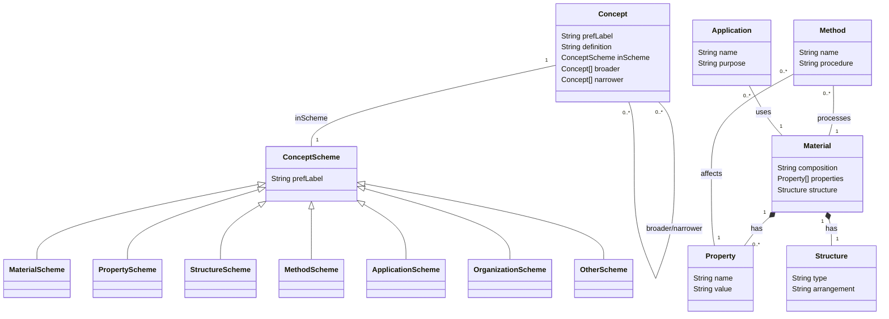

```mermaid
classDiagram
    class Concept {
        String prefLabel
        String definition
        ConceptScheme inScheme
        Concept[] broader
        Concept[] narrower
    }
    
    class ConceptScheme {
        String prefLabel
    }
    
    class Material {
        String composition
        Property[] properties
        Structure structure
    }
    
    class Property {
        String name
        String value
    }
    
    class Structure {
        String type
        String arrangement
    }
    
    class Method {
        String name
        String procedure
    }
    
    class Application {
        String name
        String purpose
    }
    
    Concept "1" -- "1" ConceptScheme : inScheme
    Concept "0..*" -- "0..*" Concept : broader/narrower
    
    Material "1" *-- "0..*" Property : has
    Material "1" *-- "1" Structure : has
    Method "0..*" -- "1" Material : processes
    Method "0..*" -- "1" Property : affects
    Application "0..*" -- "1" Material : uses
    
    ConceptScheme <|-- MaterialScheme
    ConceptScheme <|-- PropertyScheme
    ConceptScheme <|-- StructureScheme
    ConceptScheme <|-- MethodScheme
    ConceptScheme <|-- ApplicationScheme
    ConceptScheme <|-- OrganizationScheme
    ConceptScheme <|-- OtherScheme
```